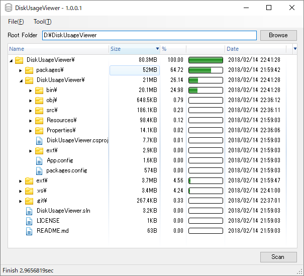

# DiskUsageViewer

## Description
DiskUsageViewer is a software that displays disk usage statistics.
This software stores the progress to the database (SQLite).
This reduces the memory usage, and it works stably in systems that contain many files.

## Screenshot

